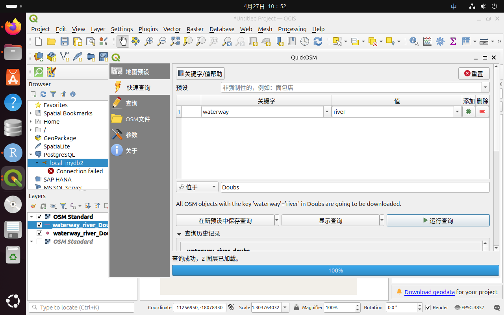
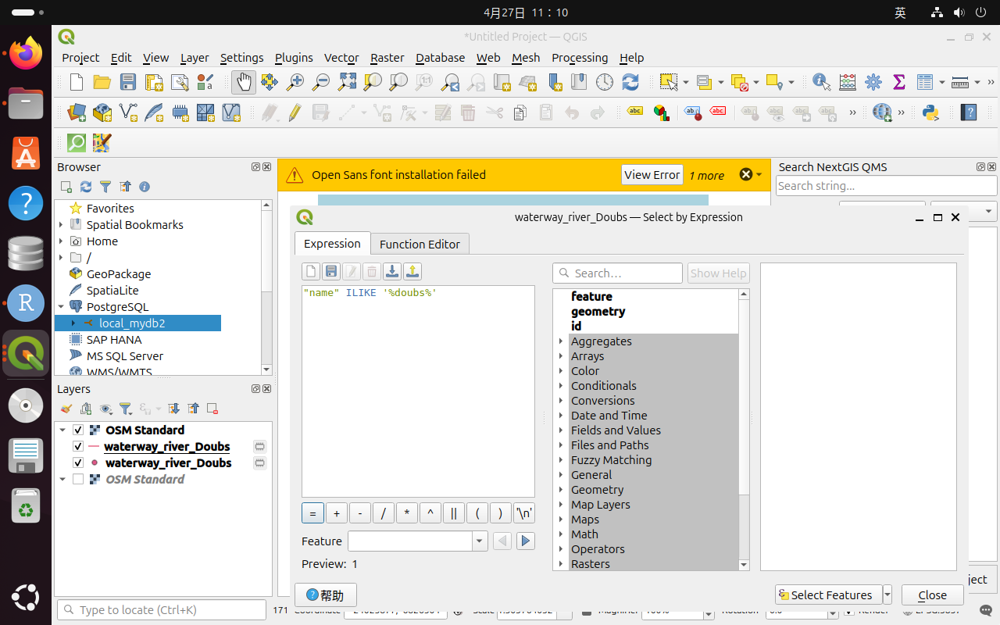
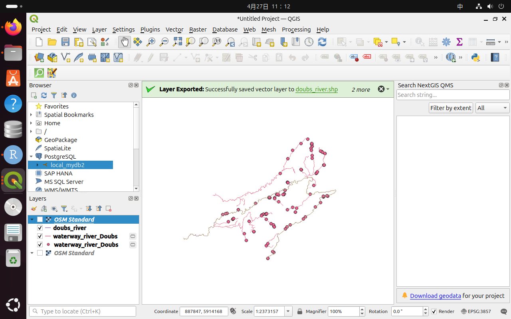
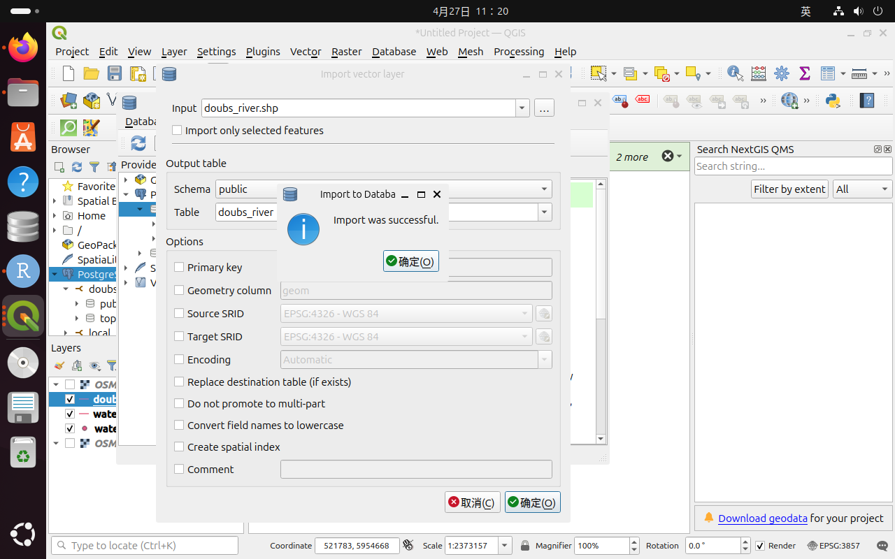
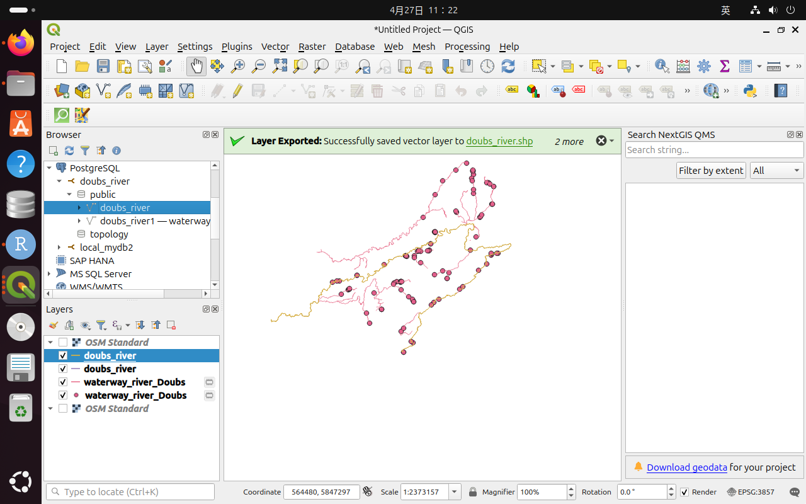

## 1. 在QGIS中安装Quickmapservices和quickOSM插件，利用它们访问和下载doubs的Openstreetmap数据，通过选择特征获得doubs，并将图层以doubs_river.shp格式，保存到postgresql数据库中。
步骤1：安装插件
打开 QGIS，在菜单栏点击“Plugins → Manage and Install Plugins”，进入插件管理界面。在搜索框中分别输入“QuickMapServices”和“QuickOSM”，找到后点击“Install Plugin”进行安装。

步骤2：加载底图（QuickMapServices）
在菜单栏点击“Web → QuickMapServices → Settings”，进入设置后点击“More services → Get contributed pack → OK”。然后返回菜单，点击“Web → QuickMapServices → OSM → OSM Standard”，加载 OpenStreetMap 底图。

步骤3：下载 Doubs 河流数据（QuickOSM）
在菜单栏点击“Vector → QuickOSM → QuickOSM”，打开工具后，在 Quick Query 中设置：Key 为“waterway”，Value 为“river”，In 为“Doubs”，然后点击“Run query”运行查询，获取相关河流数据图层。

步骤4：筛选 Doubs 河流要素
在图层面板中选择下载得到的河流图层，右键打开属性表，点击“Select by Expression”，输入表达式 "name" = 'Doubs'，执行选择操作，从所有河流中筛选出 Doubs 河。


步骤5：导出为 Shapefile 文件
右键图层选择“Export → Save Selected Features As”，在弹出窗口中设置格式为“ESRI Shapefile”，文件名为“doubs_river.shp”，并勾选“Save only selected features”，点击“OK”完成导出。

步骤6：导入 PostgreSQL 数据库
在 Browser 面板中右键“PostgreSQL”新建连接，填写数据库信息并连接成功后，打开“Database → DB Manager”，选择“Import Layer/File”，导入“doubs_river.shp”，设置 schema 和表名（如 doubs_river），完成后即可在数据库中查看并使用该图层。


## 2. 以R内置的doubs数据集为例，进行探索分析（Exploratory Data Analysis, EDA），并回答如下问题，涉及代码嵌入文本中：
1）将doubs数据集导入R，查看其中的fish表中各个观察站点的鱼群，从fish、env、xy表中删除无鱼站点，形成新数据表xx_clean。
```{r}
library(ade4)
library(vegan)
library(dplyr)
library(cluster)

data(doubs)

# 将 doubs 数据中的三个表分别提取出来
fish <- doubs$fish    # 鱼类群落数据
env  <- doubs$env     # 环境变量数据
xy   <- doubs$xy      # 样点空间坐标数据

# 计算每一个样点中所有鱼类的总个体数
row_sums <- rowSums(fish)

# 查看哪些样点没有鱼
which(row_sums == 0)

# doubs 数据集中第 8 个样点没有鱼，因此删除第 8 个样点
fish_clean <- fish[-8, ]
env_clean  <- env[-8, ]
xy_clean   <- xy[-8, ]

# 查看删除后的数据维度
dim(fish_clean)
dim(env_clean)
dim(xy_clean)

# 检查删除无鱼样点后，是否还存在鱼类总数为 0 的样点
rowSums(fish_clean)
```
2）对于fish_clean，先执行hellinger转换，然后计算样地/样点的鱼群之间的欧式距离，进行相似性分析（即Q-mode），并绘制ward最小方差的聚类图。
```{r}
#Hellinger转换
spe_hel <- decostand(fish_clean, method = "hellinger")
head(spe_hel)
summary(spe_hel)# 查看转换后的鱼类数据

#计算欧式距离
spe_dist <- dist(spe_hel, method = "euclidean")
spe_dist# 查看距离矩阵

#Ward聚类
spe_clust <- hclust(spe_dist, method = "ward.D2")
plot(spe_clust,# 绘制聚类树
     hang = -1,
     main = "Q-mode cluster analysis of fish communities",
     xlab = "Sampling sites",
     ylab = "Euclidean distance")
# 添加矩形框，便于观察聚类结果
rect.hclust(spe_clust, k = 4, border = "red")
```
3）对于env_clean，可通过主成分分析（principle component analysis, PCA），开展列变量之间相关性分析（R-mode），并绘制和解释PCA双序图。
① 对删除无鱼的第8号样本后的env_clean进行标准化（均值为0，标准差为1），执行如下代码：
```{r}
# 删除无鱼的第 8 号样点后，对环境变量进行标准化
# method = "standardize" 表示均值为 0，标准差为 1
env_z <- vegan::decostand(env_clean, method = "standardize")

# 查看标准化后的环境变量
head(env_z)
summary(env_z)
```
② 比较R自带的stats包里的prcomp()函数和vegan包rda()函数对标准化后的env_zS进行主成分分析，探讨变量相关性，并绘制双标图，代码如下：
```{r}
pca_env_prcomp <- prcomp(env_z)
biplot(pca_env_prcomp, scale = 0)
pca_env_rda <- vegan::rda(env_z)
biplot(pca_env_rda, scaling = 2)
```
③ 从样点或变量角度，解释步骤②产生的双标图biplot(pca_env_rda)的含义。
PCA 双标图可以同时展示样点和环境变量之间的关系。
在图中，点代表样点，箭头代表环境变量。箭头越长，说明该环境变量在 PCA 排序中的贡献越大。
两个箭头之间的夹角可以反映变量之间的相关性：
如果两个箭头方向接近，说明二者呈正相关；
如果两个箭头方向相反，说明二者呈负相关；
如果两个箭头接近垂直，说明二者相关性较弱。
从样点角度看，如果某些样点沿着某个环境变量箭头方向分布，说明这些样点在该环境变量上的数值较高。
从变量角度看，PCA 第一轴和第二轴通常反映环境梯度的主要变化方向，例如海拔、河流宽度、流速、营养盐或氧气等环境因子的综合变化。

4）对于fish与env之间关系的冗余分析（redundancy analysis，RDA），需要选择正确排序模型（单峰或线性模型）以及选择合适的env_z变量，根据最终结果绘图并解释。
① 针对spe_hel与env_z关系分析，需要选择线性模型（RDA）和单峰模型（Canonical Correspondence Analysis，CCA），通过运行如下代码，获得第一轴DCA1长度，当DCA1__<3___，选择用RDA，当DCA1__>4__，选择CCA。
```{r}
# 使用 DCA 判断应该选择线性模型 RDA 还是单峰模型 CCA
dca_spe <- decorana(spe_hel)

# 查看 DCA 结果
dca_spe
```
② 如果进行spe_hel的RDA分析，通过手动删除env_z中__共线性较高（VIF > 10）的___变量或者通过vegan包中ordiR2step()函数最大化__调整后的 R²（adjusted R²）______，最终达到选择变量的目的。
```{r}
#RDA 初步分析
# 使用 Hellinger 转换后的鱼类数据 spe_hel
# 使用标准化后的环境变量 env_z
rda_full <- rda(spe_hel ~ ., data = as.data.frame(env_z))

# 查看 RDA 结果
summary(rda_full)

# 检验整体模型是否显著
anova(rda_full, permutations = 999)

# 检验每一条排序轴是否显著
anova(rda_full, by = "axis", permutations = 999)

# 检验每一个环境变量是否显著
anova(rda_full, by = "term", permutations = 999)
# 检查环境变量之间的共线性
vif.cca(rda_full)


#使用 ordiR2step() 进行变量选择
# 建立空模型
rda_null <- rda(spe_hel ~ 1, data = as.data.frame(env_z))

# 使用调整后的 R2 作为标准进行逐步选择
# 目的是在不过度拟合的前提下，选择最合适的环境变量
rda_step <- ordiR2step(rda_null,
                      scope = formula(rda_full),
                      direction = "forward",
                      R2scope = TRUE,
                      permutations = 999)

# 查看最终选择出的模型
rda_step

# 查看最终 RDA 模型的详细结果
summary(rda_step)

# 对最终模型进行显著性检验
anova(rda_step, permutations = 999)
anova(rda_step, by = "axis", permutations = 999)
anova(rda_step, by = "term", permutations = 999)

#绘制最终 RDA 排序图
# 绘制 RDA 排序图
plot(rda_step,
     scaling = 2,
     main = "RDA ordination of fish communities and environmental variables")

# 添加样点编号
text(rda_step,
     display = "sites",
     scaling = 2,
     col = "blue",
     cex = 0.8)

# 添加物种名称
text(rda_step,
     display = "species",
     scaling = 2,
     col = "red",
     cex = 0.7)

```
