## 1. 对于Doubs数据集，采样点的坐标单位为米，但没有坐标系信息，只有利用QGIS通过地理配准方法确定。请简述利用QGIS获取地理坐标系的过程，并给出对应点的地理坐标。
(1)将 Doubs 数据中的采样点坐标文件 pointcoord_utm.csv 导入 QGIS。具体操作为通过菜单栏 Layer → Add Layer → Add Delimited Text Layer，选择 csv 文件，并指定 x 和 y 字段作为坐标字段，从而生成初始的采样点图层。
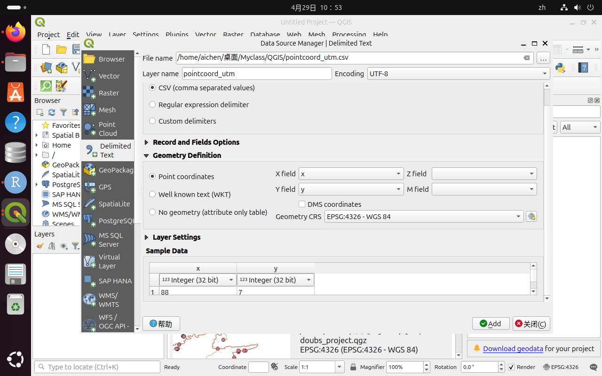

(2)将生成的采样点图层导出为矢量数据和图片。先右键图层选择 Export → Save Features As，保存为 shp 文件；然后通过 Project → Import/Export → Export Map to Image 将当前采样点图层导出为 sample_points.png，用于后续地理配准。
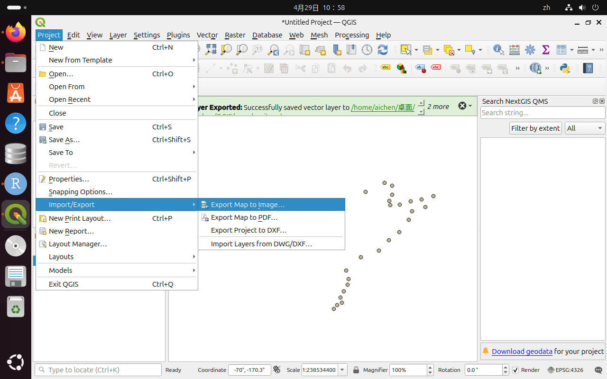

(3)在 QGIS 中加载参考空间数据，包括 Doubs 河流矢量数据 doubs_river.shp（其坐标系为 EPSG:4326）以及 OSM 底图。这些图层提供真实地理位置，用于后续对采样点进行空间定位。
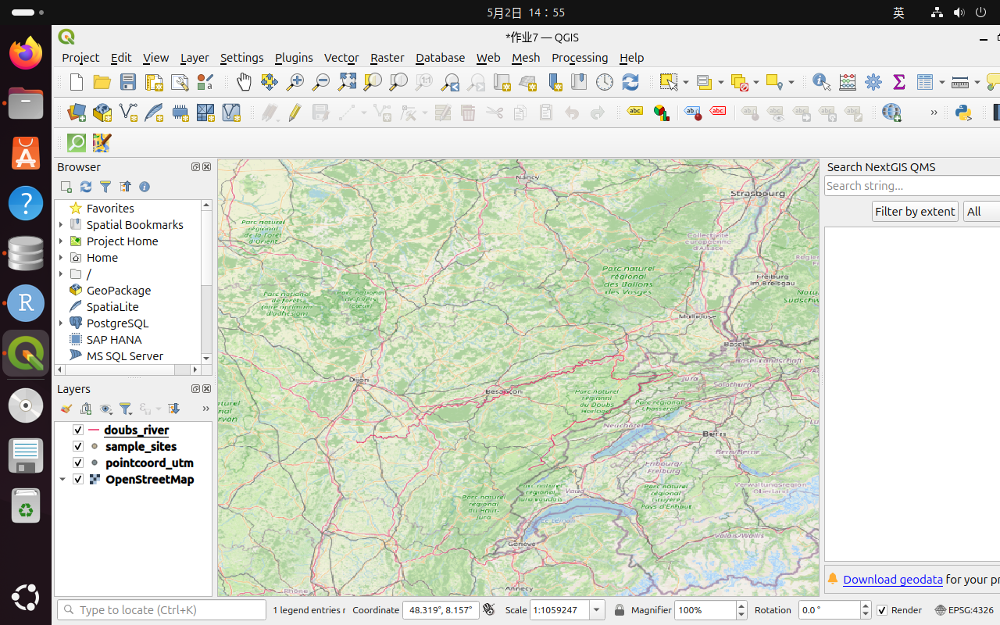


(4)在 QGIS 中安装并使用 Freehand Raster Georeference 插件，使用 Freehand Raster Georeference 插件导入采样点图像文件，并通过移动、旋转、缩放等操作，使图像中的采样点尽量与 Doubs 河流位置匹配。
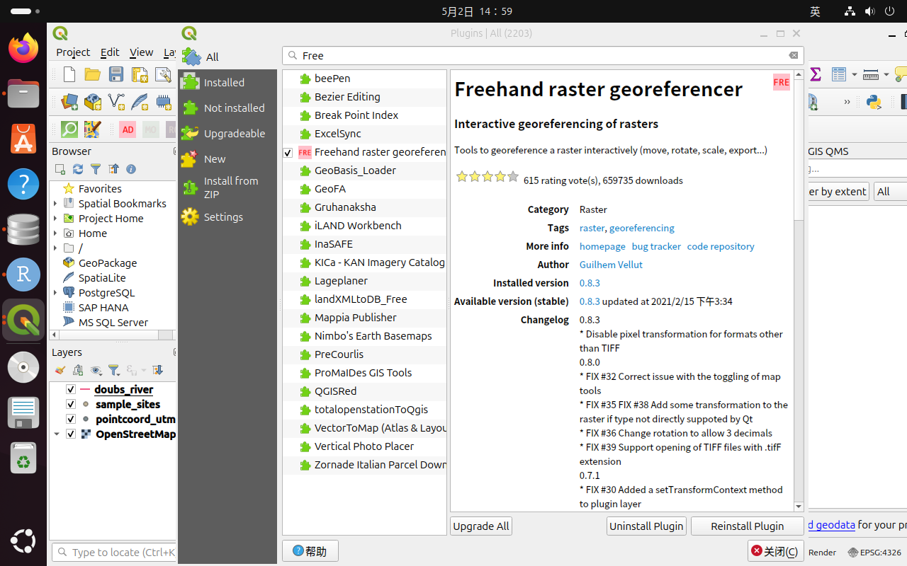
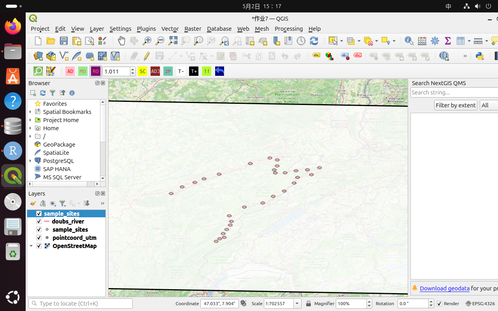
(5)在完成地理配准后，新建一个点类型的 Shapefile 图层（CRS 设置为 EPSG:4326），并开启编辑模式（Toggle Editing），使用 “Add Point Feature” 工具，根据配准后的图像逐个点击采样点位置，从而重新数字化生成具有真实地理坐标的采样点图层。
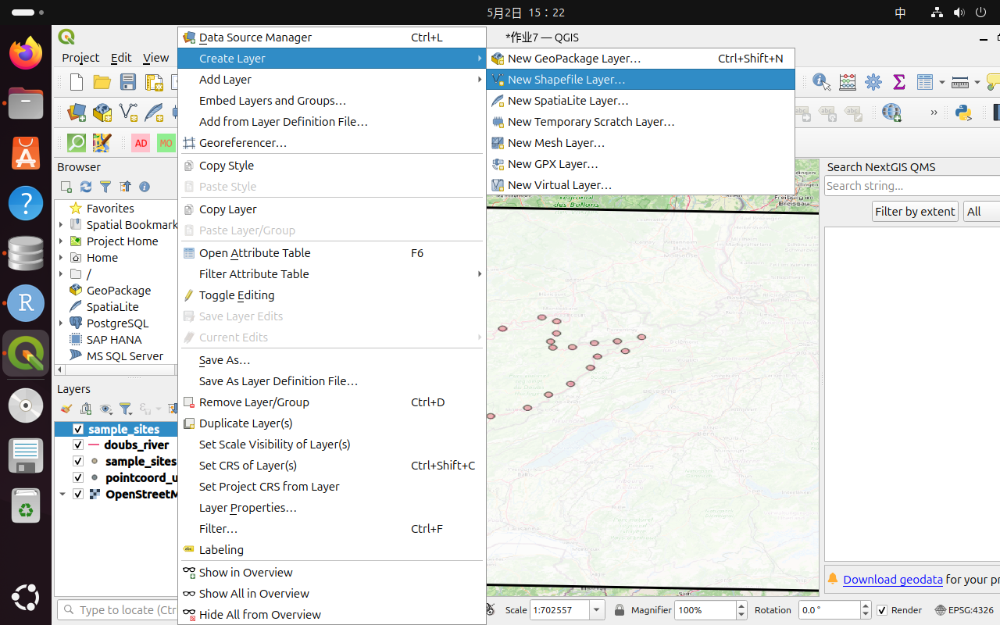
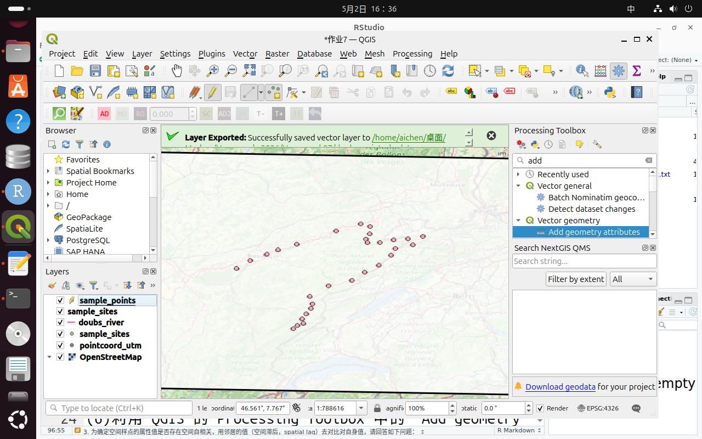

(6)利用 QGIS 的 Processing Toolbox 中的 “Add geometry attributes” 工具，对新建的采样点图层计算几何属性，从而自动提取每个点的经度（longitude）和纬度（latitude）信息，并将其写入属性表中。
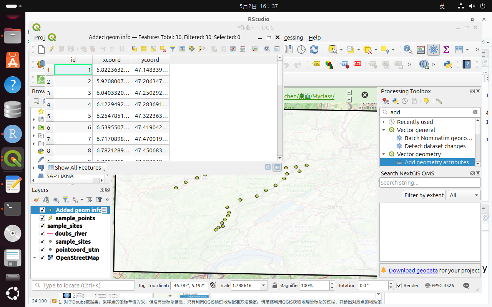

(7)将包含经纬度信息的采样点图层导出为 CSV 文件。通过右键图层选择 Export → Save Features As，格式选择为 Comma Separated Value (CSV)，坐标系保持为 EPSG:4326，即可得到每个采样点对应的地理坐标数据。
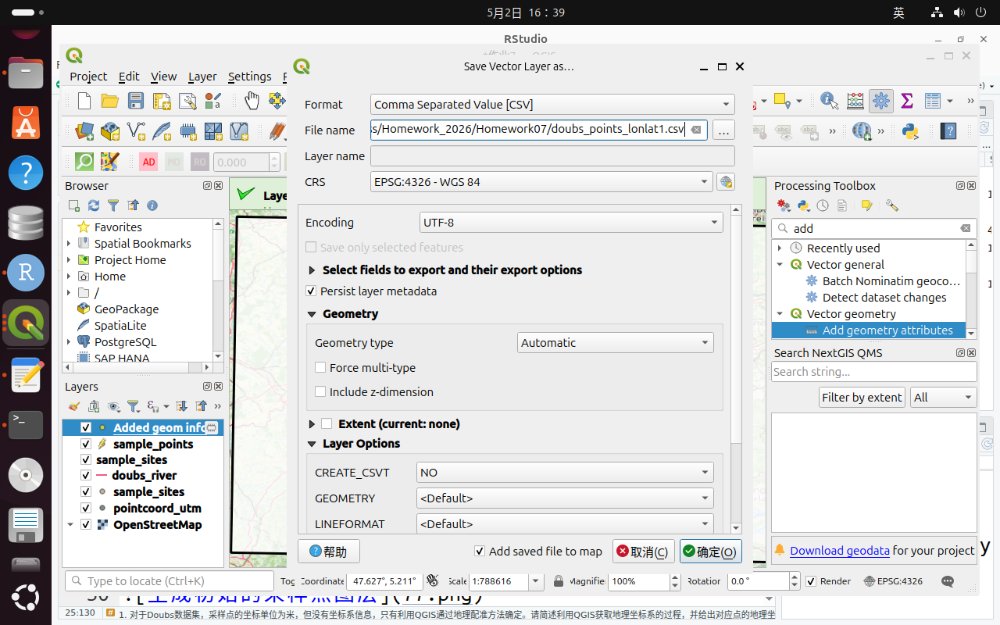
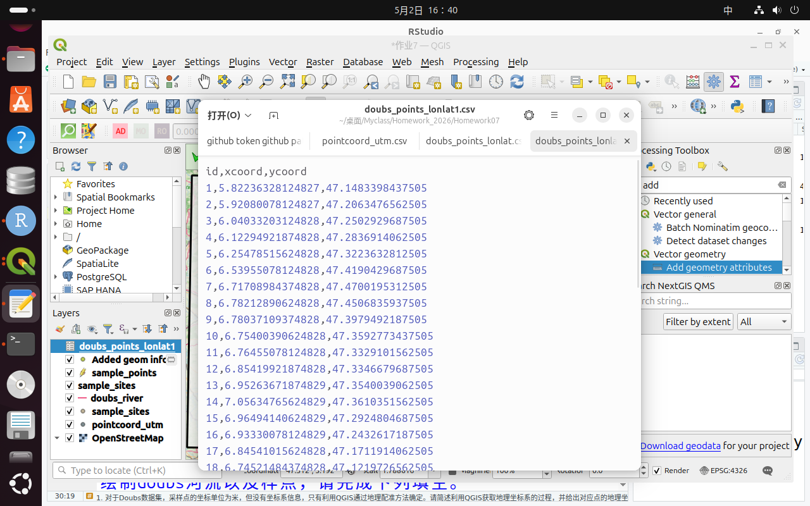
## 2. 利用ggplot2包，在doubs河流区域数字高程图（DEM）绘制doubs河流以及样点，请完成下列填空。

dem_df <- as.data.frame(doubs_dem, xy = TRUE, na.rm = TRUE)
st_crs(doubs_dem) <- st_crs(doubs_river)
ggplot() +
  geom_raster(data = dem_df, aes(x = x, y = y, fill = doubs_dem)) +
  geom_sf(data = doubs_pts, aes(geometry = geometry), color = "red") +
  geom_sf(data = doubs_river, aes(geometry = geometry), color = "yellow") +
  theme_minimal()
```{r}
# 加载需要使用的 R 包
library(sf)
library(terra)
library(ggplot2)

# A) 读取 Doubs 河流矢量数据
doubs_river <- read_sf("/home/aichen/doubs_river.shp")

# B) 读取 Doubs 河流区域的 DEM 栅格数据
doubs_dem <- terra::rast("/home/aichen/桌面/Myclass/Homework_2026/Homework07/doubs_dem.tif")

# C) 读取通过 QGIS 地理配准得到的采样点数据
doubs_pts <- read_sf("/home/aichen/sample_points.shp")

# D) 查看 DEM 的坐标系
terra::crs(doubs_dem, proj = TRUE)

# E) 由于 terra::rast 读入的 DEM 是 SpatRaster 对象，
#    不能使用 st_crs(doubs_dem) <- ...
#    因此这里要使用 terra::crs() 来设置 DEM 的 CRS
#    课堂中 doubs_river.shp 的 CRS 为 EPSG:4326
terra::crs(doubs_dem) <- sf::st_crs(doubs_river)$wkt

# F) 将 DEM 栅格数据转换为 data.frame，
#    xy = TRUE 表示保留每个栅格像元的 x、y 坐标，
#    na.rm = TRUE 表示删除 NA 像元
dem_df <- as.data.frame(doubs_dem, xy = TRUE, na.rm = TRUE)

# 查看 DEM 转换后的字段名，确认高程字段名称
colnames(dem_df)

# G) 使用 ggplot2 绘制 DEM、采样点和 Doubs 河流
ggplot() +
  # 绘制 DEM 栅格图
  geom_raster(
    data = dem_df,
    aes(x = x, y = y, fill = doubs_dem)
  ) +
  # 绘制 QGIS 地理配准后的采样点
  geom_sf(
    data = doubs_pts,
    aes(geometry = geometry),
    color = "red",
    size = 1
  ) +
  # 绘制 Doubs 河流
  geom_sf(
    data = doubs_river,
    aes(geometry = geometry),
    color = "yellow",
    size = 0.5
  ) +
  # 使用简洁主题
  theme_minimal()
```

## 3. 为确定空间样点的属性值是否存在空间自相关，用邻居的值（空间滞后，spatial lag）去对比对自身值，请回答如下问题：
1）下图展示中心样点（蓝色）的Rook邻近（黄色）和Queen邻近（黄色），请分别给出蓝色样点的两种空间邻近的空间权重。
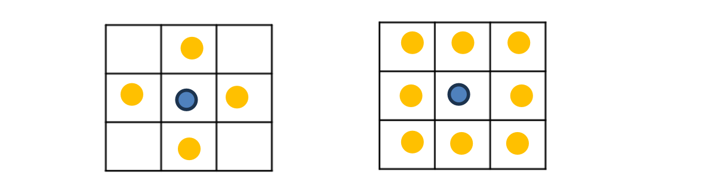
第一张图表示的是Rook相邻，蓝色位置的空间邻近为蓝色圈的上（2）、下（8）、左（4）、右（6）四个黄色圈。
二值邻接为：(0,1,0,1,0,1,0,1,0)
Wij=1/4=0.25
行标准化空间权重:(0,0.25,0,0.25,0,0.25,0,0.25,0)
即 2、4、6、8 的权重均为 0.25。
第二张图表示的是Queen相邻，蓝色位置的空间邻近为蓝色圈的左上（1）、上（2）、右上（3）、左（4）、右（6）、左下（7）、下（8）、右下（9）八个黄色圈。
二值邻接为：(1,1,1,1,0,1,1,1,1)
Wij=1/8=0.125
行标准化后：(0.125,0.125,0.125,0.125,0,0.125,0.125,0.125,0.125)
即除中心点 5 号外，其余 8 个格子的权重均为 0.125

2）常用Moran‘s scatter plot（MSL）和Lagged mean plot（LMP）两种图将空间滞后比对自身值，MSL和LMP图中的横坐标和纵坐标分别是什么？两图中都有一直线，此直线分别表达的意思是什么？
Moran’s I 是衡量空间自相关的重要指标。它的核心思想是：将一个样点自身的属性值与其邻居的空间滞后值进行比较，从而判断空间上相近的样点是否具有相似属性。

（1）Moran’s scatter plot（MSL）
横坐标：样点自身的标准化属性值
纵坐标：邻居属性值的空间滞后值，即邻居值的加权平均
图中直线的斜率：表示 Global Moran’s I这条直线反映的是整体空间自相关方向和强度。如果直线斜率为正，说明高值周围倾向于仍然是高值，低值周围倾向于仍然是低值，即存在正空间自相关；如果直线斜率为负，则说明高值周围倾向于低值，低值周围倾向于高值，即存在负空间自相关。

（2）Lagged mean plot（LMP）
 也将空间滞后值与自身值进行比较，但它通常更直观地使用原始属性值。
横坐标：样点自身的原始属性值 
纵坐标：邻居的加权平均值，即 spatial lag mean
图中的直线表示样点自身值与其邻域平均值之间的线性关系。如果直线呈明显正斜率，说明样点值越高，其邻居平均值也越高，表明空间上存在相似值聚集；如果斜率较小或接近水平，则说明样点自身值与邻居均值关系较弱，空间自相关不明显。

## 4. 若样点属性值存在空间自相关，可以通过创建预测各网格，并计算各网格到样点的缓冲距离（buffer distance）作为机器学习模型的输入特征，请解释什么是缓冲距离。
如果样点属性值存在空间自相关，说明样点之间的空间距离会影响属性值的相似性。为了把这种空间影响转化为机器学习模型能够识别的变量，可以在研究区内建立预测网格，并计算每个网格到已有样点的缓冲距离。

缓冲距离是指某个网格或空间位置到样点的距离，或者以样点为中心向外扩展形成的影响范围半径。它本质上是在量化“一个样点对周围空间的影响范围”。

例如，在生态学研究中，一个采样点可以代表某种环境条件或物种分布信息。距离该采样点越近的网格，可能越容易受到该点所代表环境特征的影响；距离越远，这种影响可能逐渐减弱。因此，缓冲距离可以作为机器学习模型的输入特征，用来帮助模型学习空间位置与生态属性之间的关系。
